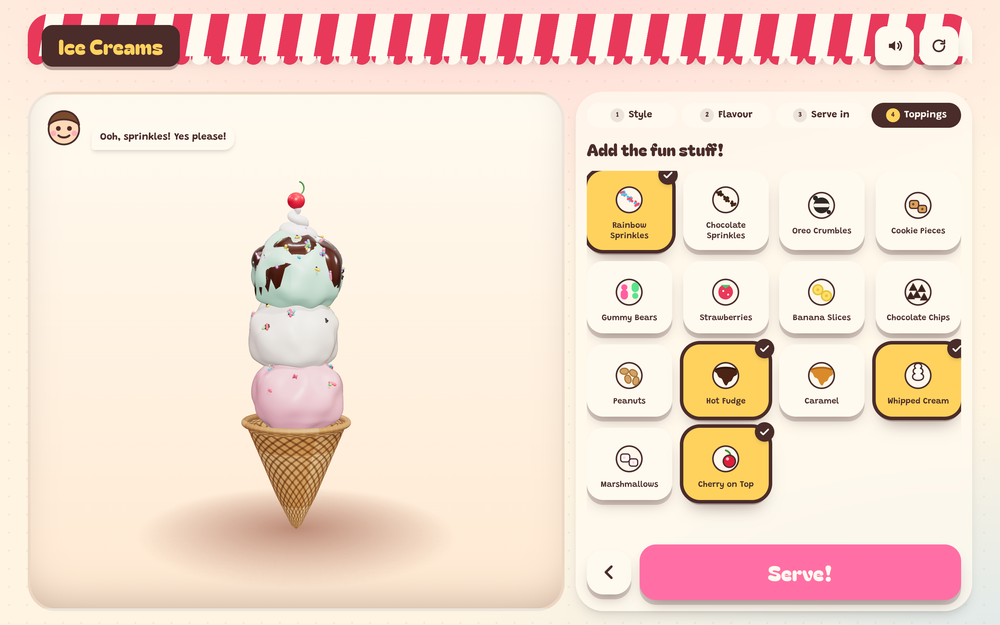
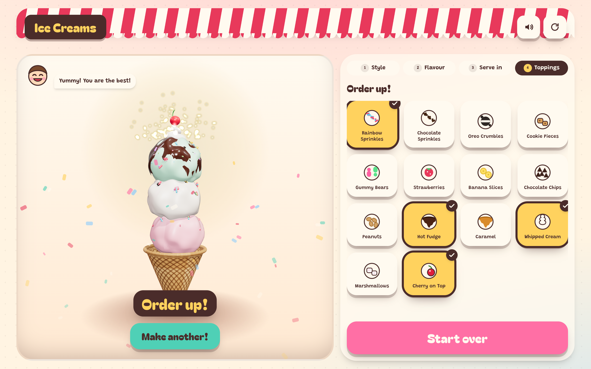
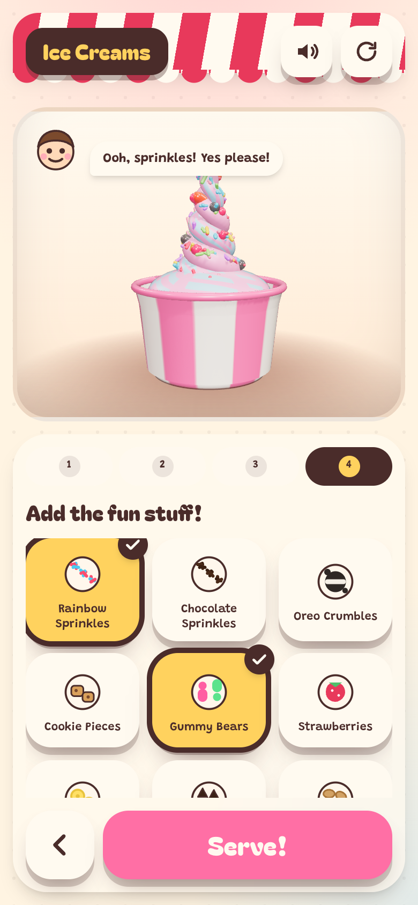

<div align="center">

# Mila's Ice Cream Shop

**A pretend-play ice cream shop in 3D, built for a two-and-a-half-year-old.**

Pick a swirl or scoops, choose from 30 flavours, pick a cone, a cup or a six-well egg carton,
pile on the toppings, then hit the big pink **Serve!** button for a confetti ta-da.

[](https://nextjs.org)
[](https://www.typescriptlang.org)
[](https://threejs.org)
[](https://tailwindcss.com)
[](LICENSE)



</div>

---

## What it is

A 3 to 5 minute pretend-play loop for a toddler: take the order, make the ice cream, serve it.
Every choice changes a real 3D model on screen, so the ice cream she is building is the ice cream
she sees. There is no reading required - every button is a picture.

| | |
|---|---|
| **2 styles** | Soft swirl (one braided ribbon per flavour, up to 5) and hand-dug scoops |
| **30 flavours** | Vanilla, chocolate, strawberry, mint chip, cookies and cream, cookie dough, caramel, bubblegum, birthday cake, rocky road, pistachio, mango, blueberry, peanut butter, neapolitan, purple cow, raisin, coconut, banana, pina colada, orange, pineapple, peach, coffee, watermelon, lime, lemon, raspberry, cotton candy, cherry |
| **9 containers** | Cup, waffle cone, cake cone, sundae glass, float, waffle bowl, paper boat, pink egg carton (6 wells, scoops only), frosty cup |
| **14 toppings** | Sprinkles, Oreo crumbles, cookie pieces, gummy bears, fruit, chocolate chips, peanuts, hot fudge, caramel, whipped cream, marshmallows, cherry |
| **The ta-da** | Confetti, a sparkle burst, a glow and a little fanfare when the order is served |

<div align="center">


</div>

## Built for little hands

- **Pictures, not words.** Every choice is a hand-drawn SVG of the real thing.
- **Big targets.** The choice buttons are 88px tall and every control clears 44px, down to a 320px screen.
- **No dead ends.** Picking a 7th topping drops the oldest one instead of disabling the button, and a step
  is only offered once the answers it needs are in.
- **Double taps do not punish.** A toddler taps twice while the screen is still moving, so a tap that lands
  within 300ms of a change is ignored - and the serve holds that guard for 1.2s so the ta-da cannot be
  tapped away.
- **No way to break it.** No menus, no settings, no external links, no in-app purchases, no network calls.
- **Sound that can be turned off.** All audio is synthesised in the browser and the mute state is remembered.
- **Accessible.** Real button semantics, `aria-pressed` state, visible focus rings, focus moved to each new
  question as it appears, a spoken description of the dessert on the canvas, and `prefers-reduced-motion`
  honoured in the CSS, the confetti and the 3D scene (no spin, no sparkle burst, no light flash).

## Quick start

```bash
git clone https://github.com/bunlongheng/ice-creams.git
cd ice-creams
npm install
npm run dev
```

Open <http://localhost:3047>.

### Scripts

| Command | What it does |
|---|---|
| `npm run dev` | Dev server on port 3047 |
| `npm run build` | Production build |
| `npm start` | Serve the production build on port 3047 |
| `npm run lint` | ESLint (`next/core-web-vitals` + TypeScript rules) |
| `npm run typecheck` | `tsc --noEmit` |
| `npm test` | Vitest unit tests for the order logic and the 3D helpers |

## Environment variables

**None are required.** The app has no backend, no database, no API keys and makes no network requests
at runtime. `.env.example` documents the single optional value:

| Variable | Required | Default | Purpose |
|---|---|---|---|
| `NEXT_PUBLIC_SITE_URL` | No | Vercel's production domain, else unset | Absolute base for the canonical and Open Graph URLs. On Vercel it falls back to `NEXT_PUBLIC_VERCEL_PROJECT_PRODUCTION_URL`, so set it only for a custom domain or a self-hosted deploy. |

Real values never belong in the repository - copy `.env.example` to `.env.local`, which is gitignored.

## Project layout

```
src/
  app/
    layout.tsx          Fonts, metadata, viewport
    page.tsx            Renders the shop
    globals.css         Design tokens, the sticker button, the awning, keyframes
    icon.svg            Favicon
  components/
    Shop.tsx            The one stateful component: order state, steps, sounds
    scene/
      IceCreamCanvas.tsx  React <-> Three.js bridge (client only, dynamically imported)
    ui/
      Art.tsx           Hand-drawn SVG art for every choice
      ChoiceGrid.tsx    The picture-button grid used by all four steps
      StepBar.tsx       Step progress and back-navigation
      Celebration.tsx   Confetti overlay for the serve moment
  lib/
    catalog.ts          Styles, flavours, vessels, toppings - the single source of truth
    creation.ts         Pure reducer for one order (+ unit tests)
    sound.ts            Web Audio synthesis, no audio files
    random.ts           Seeded RNG and value noise (+ unit tests)
  scene/
    IceCreamScene.ts    Owns the WebGL canvas, lights, camera and render loop
    iceCream.ts         Soft-serve swirls and hand-dug scoops
    vessels.ts          Cones, cups, glasses and bowls
    toppings.ts         Sauces, cream, scattered bits, the cherry
    geometry.ts         Swept tubes, lathes, scoop noise, sauce drips
    materials.ts        Shared, cached material recipes (+ unit tests)
    scatter.ts          Instanced scattering of bits over a surface
    textures.ts         Canvas-drawn textures - no image assets
    sparkles.ts         The celebration particle burst
docs/screenshots/       README images
```

## How the 3D works

Everything on screen is generated from maths at runtime - there are no downloaded models,
no textures and no HDR maps, which keeps the payload small and the shop instantly re-skinnable.

- **Soft serve** is a circle swept along a tapering helix, with the tube radius shrinking as it rises.
  A twist is two of those coils, half a turn out of phase.
- **Scoops** are spheres displaced by 3D value noise, with a flattened underside where they sat in the tub.
- **Sauce** is a cap that follows the same noise function as the scoop under it, then runs down the side
  in uneven tongues, so hot fudge hugs the lumps instead of floating above them.
- **Toppings** are instanced meshes scattered onto anchor points sampled from the dessert's surface.
- **Gloss** comes from a physically based material with a clear coat, lit by a procedural room
  environment for real reflections.
- **Nothing is random.** A seeded RNG means the same order always rebuilds the same dessert.

React never re-renders per frame: `IceCreamScene` owns its own `requestAnimationFrame` loop, pauses when the
tab is hidden and clamps the pixel ratio to 2. Geometry is rebuilt and disposed on every change, but materials
are **cached and shared** - disposing a material throws away its compiled shader program, so a fresh one per
tap would recompile half a dozen shaders in the next frame. The scene also only rebuilds when the dessert
itself changed: stepping backwards and forwards touches nothing.

## Deploying

The repo is Vercel-ready (`vercel.json` pins the framework, install and build commands):

```bash
npm i -g vercel
vercel link
vercel --prod
```

No environment variables need to be set for a working deployment. Security headers - CSP, HSTS,
`X-Frame-Options`, `X-Content-Type-Options`, `Referrer-Policy` and `Permissions-Policy` - are applied to
every response from `next.config.ts`.

Any host that can run `npm run build && npm start` works too; the app is a standard Next.js App Router build.

## Contributing

Adding a flavour or a topping is a one-line change in `src/lib/catalog.ts` - the buttons, the 3D model
and the tests all read from that table. Please run `npm run lint`, `npm run typecheck` and `npm test`
before opening a pull request.

## License

[MIT](LICENSE) - Bunlong Heng
